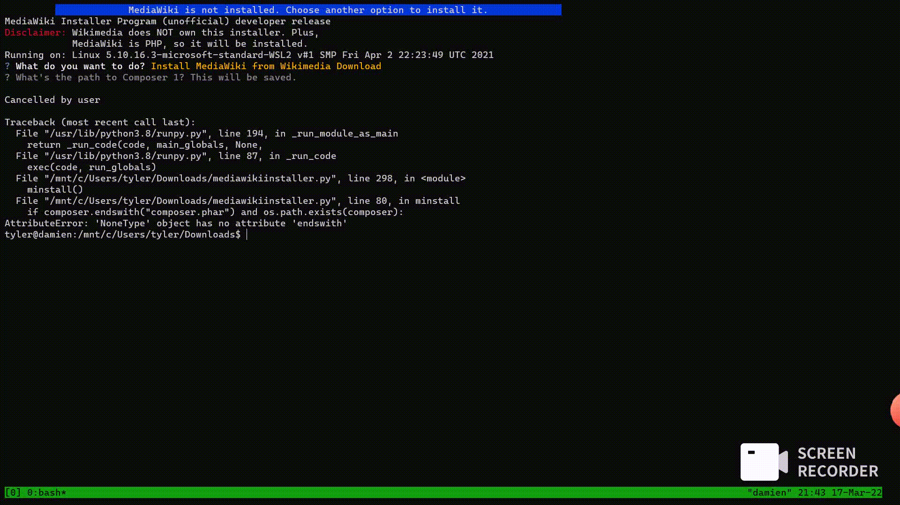

  <h1>
    MediaWiki Installer
  </h1>

A quick installer for MediaWiki written in Python.

***

Installing MediaWiki takes so many steps. As such, it's really hard to choose it. MediaWiki Installer automates the installation.

All of these steps are too long. We need to programmatically install it to make this even more faster
and less boring. MW Installer asks you a few questions to process when installing.

